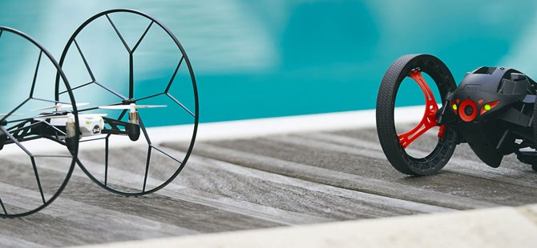
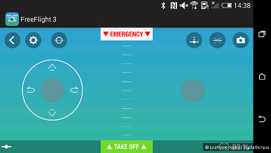
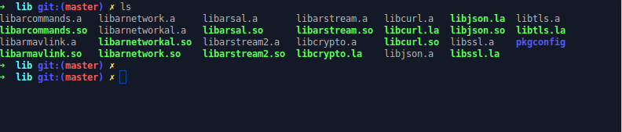
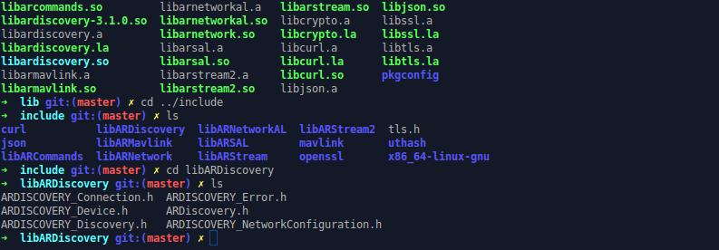
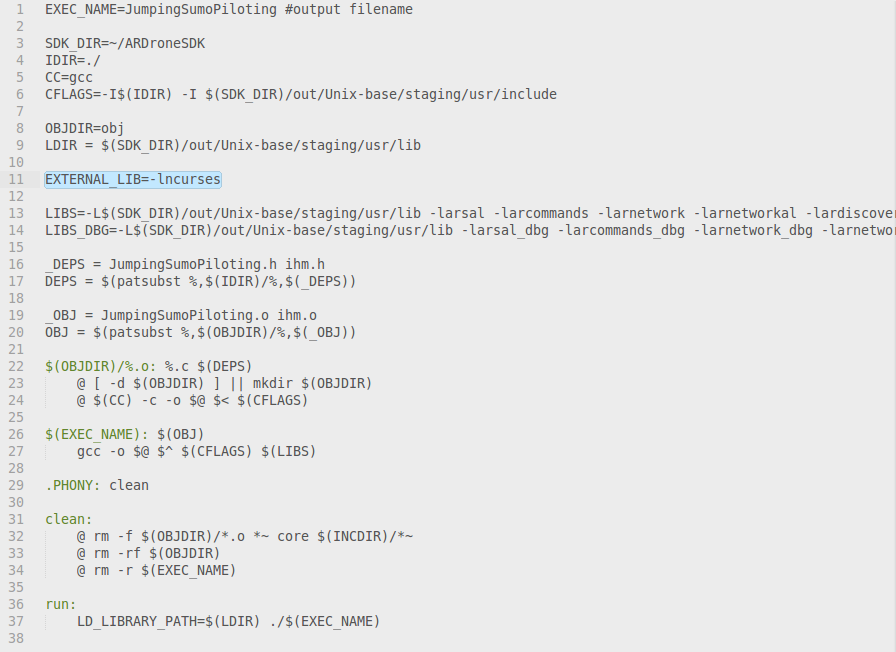
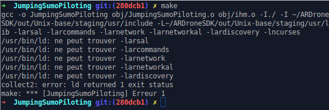

## Parrot SDK: Prise en main et possibilités d'utilisation

ARDroneSDK3 est à ce jour la dernière version du Parrot SDK, publiée en novembre 2014. Pour faire simple, ce SDK permet de contrôler la plupart des drones et/ou minidrones de Parrot (Rolling Spider, Bebop Drone, Skycontroller, Jumping Sumo).
Il faut entendre par "contrôler" le fait d'effectuer les actions suivantes : 
+ Se connecter à un drone
+ Piloter un drone
+ Recevoir du stream depuis un drone
+ Sauvegarder et télécharger des photos ou des vidéos réalisées par un drone
+ Transmettre et faire jouer des séquences automatiques de vol (autopilot flight plan)
+ Mettre à jour le drone
+ Faire du mapping 3D





**Exemple d'utilisation du Parrot SDK**: l'application FreeFlight3 qu'il est recommandé d'installer sous Android ou iOS lors de l'achat d'un drone ou minidrone, utilise l'ARDroneSDK3.





>Est-il possible de créer sa propre application de contrôle de drones avec ce SDK ?"

Oui, tout à fait, c'est tout l'intérêt de la mise à disposition des sources du SDK. Si vous avez des compétences en développement d'applications mobiles (Android ou iOS), il vous suffira de créer un projet de développement mobile (Android Studio, Plugin Eclipse ADT, XCode), ensuite de mettre en place les dépendances nécessaires pour avoir la main sur les librairies du SDK et enfin les utiliser à votre escient dans le code de votre application mobile.
Il est aussi possible d'implémenter une application de type client lourd en C permettant de contrôler le drone depuis un laptop (ici sous xubuntu 14.04) 

En effet, les sources du SDK sont hébergés dans un répertoire Github sous licence BSD. Ce répertoire contient principalement : 
+ Les sources des différentes librairies qui constituent le SDK
+ Des utilitaires de Build
+ Un manifest
+ Quelques exemples d'utilisation du SDK pour chaque plateforme (Unix, Android, iOS)

On peut retrouver l'organisation complète du SDK par [ici](http://developer.parrot.com/docs/bebop/?c#organisation)

## Comment utiliser le SDK ?

Le SDK est principalement écrit en C, et fourni donc des librairies pour les Systèmes Unix, Android et iOS respectivement utilisables en C, Java et Objective C.

**NB**: Les manipulations pour ce billet concernent les plateformes Unix et Android.

### Outils pré-requis
Il faut commencer par installer au préalable les outils suivants:
+ [curl](#curl)
+ [repo](#repo)
+ [git](#git)
+ [automake](#automake)
+ [libtool](#libtool)
+ [yasm](#yasm)
+ [nasm](#nasm)

<a name="curl"></a>
#### Installer curl
Dans un terminal, Faire `$ sudo apt-get install curl`

<a name="repo"></a>
#### Installer Repo tool

```
$ mkdir ~/bin
$ PATH=~/bin:$PATH
$ curl https://storage.googleapis.com/git-repo-downloads/repo > ~/bin/repo
$ chmod a+x ~/bin/repo
```

#### Installer git
<a name="git"></a>
Faire `$ sudo apt-get insall git-core`
Ensuite effectuer la config minimale

```
$ git config --global user.name "Your Name"
$ git config --global user.email "jhon@doe.com"
```

<a name="automake"></a>
#### Installer automake

Automake étant inclu dans autoconf, on installe simplement autoconf

`$ sudo apt-get install autoconf`

<a name="libtool"></a>
#### Installer libtool

`$ sudo apt-get install libtool`

<a name="yasm"></a>
#### Installer yasm

`$ sudo apt-get install yasm`

<a name="nasm"></a>
#### Installer nasm

`$ sudo apt-get install nasm`

### Étape 1: Récupération des sources avec Repo
1.Créer un dossier vide dans lequel on va mettre en place notre SDK
```
$ mkdir ~/ARDroneSDK
$ cd ~/ARDroneSDK
```
2.Lancer la commande `repo init` pour initialiser un repo avec le manifest du SDK

`$ repo init -u https://github.com/Parrot-Developers/arsdk_manifests.git`

3.Descendre l'arbre complet des sources distants du SDK

`$ repo sync`

### Étape 2: Le Build
#### Pour une plateforme Unix
Les manipulation pour un build sous Unix sont les suivantes :

```
$ cd ~/ARDroneSDK
$ ./build.sh -p Unix-forall -t build-sdk-j
```

Le résultat du build sera dans le répertoire `~/ARDroneSDK/out/Unix-base/usr`
On peut à présent faire fonctionner les exemples fournis avec le SDK qu'on peut trouver dans le répertoire `~/ARDroneSDK/packages/Samples/Unix`.

A ce jour, les instructions décrites sur le [site des développeurs Parrot](http://developer.parrot.com/docs/bebop/?c#general-build) pour faire fonctionner les exemples du SDK, sont sans issue, du moins pour Unix.
Les "Makefiles" des exemples sous Unix n'étant pas à jour par rapport à l'architecture du SDK, il faudra y effectuer quelques modifications, et faire  ensuite quelques builds atomiques de Librairies manquantes.
Focalisons nous à présent sur les manipulations à faire pour l'exemple "Jumping Sumo Piloting".

Avec votre éditeur de texte favoris, ouvrez le Makefile situé à cet emplacement
`~/ARDroneSDK/packages/Samples/Unix/JumpingSumoPiloting`, puis faites les modifications suivantes:

```
SDK_DIR=~/ARDroneSDK

CFLAGS=-I$(IDIR) -I $(SDK_DIR)/out/Unix-base/staging/usr/include

LIBS=-L$(SDK_DIR)/out/Unix-base/staging/usr/lib -larsal -larcommands -larnetwork
 -larnetworkal -lardiscovery $(EXTERNAL_LIB)

LIBS_DBG=-L$(SDK_DIR)/out/Unix-base/staging/usr/lib -larsal_dbg -larcommands_dbg
 -larnetwork_dbg -larnetworkal_dbg -lardiscovery_dbg $(EXTERNAL_LIB)
```

Vous remarquerez dans les lignes précédentes du Makefile que, 
*JumpingSumoPiloting* aura besoin des librairies `libarsal`,`libarcommands`,
`libarnetwork`,`libarnetworkal` et `libardiscovery` pour fonctionner.

*Problème* : La librairie `libardiscovery` est manquante dans le répertoire 
`~/ARDroneSDK/out/Unix-base/staging/usr/lib` qui contient l'ensemble des librairies qui ont été construites pour la plateforme Unix lors du Build complet du SDK.



*Solution* : Faire un build élémentaire pour cette librairie.

Placez vous dans le répertoire `~/ARDroneSDK/package/libARDiscovery` qui contient les sources de notre librairie manquante puis vous faites :

```
$ cd Build
$ ./bootstrap
$ ./configure --prefix=/home/rbary/ARDroneSDK/out/Unix-base/staging/usr 
--with-libARSALInclude=~/ARDroneSDK/out/Unix-base/staging/usr/include
$ make
$ make install
```

Il faut renseigner pour l'argument `--prefix` l'emplacement où l'on souhaite installer la libraire. Attention il faut donner un chemin absolu comme nous l'avons fait. On peut voir que notre librairie dépend des includes (headers) de `libARSAL` situés à cet emplacement 
`~/ARDroneSDK/out/Unix-base/staging/usr/include`

Le résultat attendu est le suivant :



`libardiscovery` est bien installé dans le répertoire 
`~/ARDroneSDK/out/Unix-base/staging/usr/lib` et les headers correspondants (qui pourront être utilisés par d'autres librairies) le sont aussi dans le répertoire `~/ARDroneSDK/out/Unix-base/staging/usr/include`

Remarque : Le répertoire `~/ARDroneSDK/package/` en plus de contenir des exemples de fonctionnement du SDK, comprend également les sources de toutes les librairies du SDK. S'il vous manque, une librairie pour un exemple donné il vous suffira de refaire la manipulation précédente pour la librairie concernée.

#### Pour une plateforme Android
[http://developer.parrot.com/docs/bebop/#android](http://developer.parrot.com/docs/bebop/#android)


### Étape 3: Utilisation du SDK
#### Exemple d'utilisation sous Unix : *JumpingSumoPiloting*
Maintenant que notre SDK est installé correctement, on peut à présent l'utiliser. Nous nous contenterons pour le moment de faire fonctionner l'un des exemples d'utilisation livré avec le SDK en l’occurrence 
*JumpingSumoPiloting*.
On peut remarquer que dans le Makefile, que notre exemple dépend d'une librairie externe : [`libncurses` ](http://arnaud-feltz.developpez.com/tutoriels/ncurses/?page=introduction#LI-A)



On installe libncurses si nécessaire:
```
$ sudo apt-get update
$ sudo apt-get install ncurses-dev
```

On compile les sources de *JumpingSumoPiloting* et on lance notre exécutable :

```
$ cd ~/ARDroneSDK/package/Samples/Unix/JumpingSumoPiloting
$ make
$ ./JumpingSumoPiloting
```

Si après le `make` vous avez une erreur comme sur l'image qui suit :



Il faudra créer un lien symbolique dans `/usr/lib` qui pointera vers chacune des librairies nécessaires pour *JumpingSumoPiloting* comme ceci:

```
sudo ln -s ~/ARDroneSDK/out/Unix-base/staging/usr/lib/[nom_de_lib].so 
/usr/lib/[nom_de_lib].so
```

On a pour `libarsal` la commande suivante:

```
sudo ln -s ~/ARDroneSDK/out/Unix-base/staging/usr/lib/libarsal.so 
/usr/lib/libarsal.so
```

Exceptionellement, pour `libardiscovery` la commande sera:

```
sudo ln -s ~/ARDroneSDK/out/Unix-base/staging/usr/lib/libardiscovery-3.1.0.so 
/usr/lib/libardiscovery-3.1.0.so
```

>Que fait JumpingSumoPiloting ?

*JumpingSumoPiloting* est un exemple basique d'utilisation du SDK qui permet de réaliser les actions suivantes:

+ rechercher un mini drone aux alentours (notre Jumping Sumo)
+ se connecter au minidrone (ici en wifi)
+ envoyer et recevoir des commandes pour piloter le minidrone (Le pilotage du drone se fait avec les touches du clavier : touches directionnelles et Espace)
+ afficher l'état de la batterie du minidrone dans une IHM

Le tableau qui suit fait un récapitulatif des services fournis par les différentes librairies du SDK qui sont utilisées par *JumpingSumoPiloting*

| Librairies     | Services          |
| ---------------| ------------------- 
| libARSAL       | Une couche d'abstraction du système |  
| libARCommands  | Les commandes qu'on peut envoyer et recevoir au/du drone| 
| libARNetwork   | L'envoi et la réception des paquets au/depuis le drone  | 
| libARNetworkal | Un couche d'abstraction pour les différents types de réseau sans-fil (Bluetooth Low Energy ou Wifi)|
| libARDiscovery | La découverte dans le réseau des drones supportés|

[Pour en savoir plus sur les autres librairies ](http://developer.parrot.com/docs/bebop/#organisation)

[Pour connaître les caractéristiques techniques du Jumping Sumo](http://www.parrot.com/fr/produits/jumping-sumo/)

#### Exemple d'utilisation sous Android : *RollingSpiderPiloting*

`~/ARDroneSDK/packages/Samples/Android/RollingSpiderPiloting`

#### Commandes et événements


